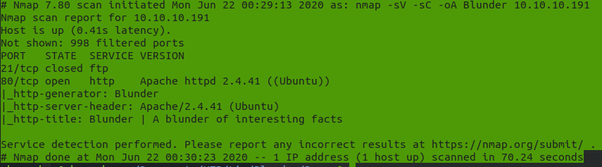

# Blunder - بالعربي

1- تبدأ الاول بعمل Scan على الماشين ب nmap عشان نشوف ال Open Ports الموجودة و ال services/الخدمات و شو منهم فيه ثغرة/vulnerable فتستغله و طبعا بدون عمل استطلاع/recon او enumeration ما ممكن تبدأ اي عملية Pentesting او Hacking



في 21 و مقفول هاد لل ftp و في 80 الي هو http و هاد غالبا بعني انو web server

1.2 - تبدأ ت scan على الويب سيرفر نفسه - لحد الان انت بمرحلة ال scan بس-  
انا عادة بستخدم اكتر من اداة متل dirsearch,dirb,wfuzz,gobuster و السبب ان احيانا اداة ممكن تعطيك نتيجة غير التانية  و طبعا لائحة الكلمات/wordlist الي بتم استخدامها بتفرق معك كتير, هون انا استخدمت dirsearch و wfuzz و وصلت للبدي ياه  
شغلت dirsearch و كانت هي النتائج و ما كان الها فائدة مباشرة 



 ف رحت مشغل wfuzz بالطريقة الاتية :   


```text
wfuzz -u http://10.10.10.191/FUZZ.txt -w ~/Documents/Wordlist/directory-list-2.3-medium.txt --hc 404
```


بما اني ضايف .txt بعد ال FUZZ فلما اجي اتصفح هدول رح احط بالاخر .txt  
نتائج ال /todo.txt 



1- متل ما مذكور بالاخير ان في شخص اسمه fergus لازم يتم اعلامه ببعض الامور ف حاليا معنا اسم مستخدم/username  
  
2- كمان في cms حصلها تحديث, هي ممكن تكون مهمة ك ملاحظة لبعدين


2- تبدأ ت exploit الي معك الان

2.1 - بعد بحث طويل و محاولة الابتعاد عن اي نوع من انواع ال brute force attack ظهر ان مافي غيرو اسويه و لقيت هاد المقال \([اضغط هنا](%20https://rastating.github.io/bludit-brute-force-mitigation-bypass/)\)

  
 اخدت نفس سكريبت الاستغلال exploitation script و عدلت عليه شوي   
هون انت محتاج كمان wordlist تستخدمها , انا استخدمت اداة cewl و جبت كل الكلمات الموجودة بالصفحة الرئيسية تبيعت الموقع

```text
cewl http://10.10.10.191/
```

  
Script : 




```text
python3 bruteforce.py
```


> **fergus:RolandDeschain**

  
حاليا معنا كلمة سر و اسم المتسخدم او credentials 

2.2 -بما انو معنا ال creds عشان نسجل دخول و بالاصل منعرف مسار الدخول , جبناه اثناء استخدام اداة dirsearch  
بعد تسجيل الدخول  


الان تبحث عن استغلال/exploit و هو رح يكون كمان لنفس ال cms الي هي bludit   
انا لقيت هاد الاستغلال \([اضغط هنا](%20https://github.com/rapid7/metasploit-framework/pull/12542)\)

  
فكل الي عليك ان تستغله بال metasploit متل ما مذكور 


حاليا عندك access او ولوج للسيرفر , هون بتبدأ عملية enumeration تانية جوا السيرفر   
المفروض انت بنفسك تروح و تبدأ ت enum اما انا رح اقلك وين تروح مباشرة   
  
2.3 -  بعد شوية enumeration رحت  للملف هاد 

> **bl-content/database/users.php**

  
و لقيت مستخدم اسمه  Hugo و الهاش الخاص فيه

> "faca404fd5c0a31cf1897b823c695c85cffeb98d"

  
باستخدام hashid حددت انه sha1  


باستخدام اي موقع ممكن تكراك الهاش هاد انا استخدمت هاد الموقع \([اضغط هنا](%20https://md5decrypt.net/en/Sha1/)\)


حاليا معك creds جديدة

> **hugo:Password120**

  
2.4 - صار فيك تعمل شي اسمه Privileges Escalation او تصعيد الصلاحيات   
بسهولة رح تدخل باسم hugo 

```text
su hugo
```

 و تحط كلمة سر و حاليا انت جوا باسم hugo و معك صلاحياته  
و رح تلاقي ال user.txt كمان  
  
3 - حالبا تبدا تعمل priv esc مرة تانية و توصل لل root  
اسهل طريقة و هي عبارة عن mis-configuration من قبل ال Server administrator او الشخص الي عم يشتغل باسم المستخدم هاد.  


```text
sudo -l
```

  
**** و رح تشوف :

> **\(ALL, !root\) /bin/bash**

تبحث عنها ب جوجل و رح تلاقي ان اصلا sudo مصاب بثغرة بتسمح نعمل priv esc  انا لقيت الاستغلال على exploit-db \([اضغط هنا](%20https://www.exploit-db.com/exploits/47502)\)

  
بكل سهولة الان :

```text
sudo -u#-1 /bin/bash
```

و بهيك صرت ال root و معك صلاحيات الرووت و ممكن تعمل check باستخدام

```text
whoami
```

و بهيك مبروك عليك خلصت الماشين   
نراكم على خير - السلام عليكم.  


